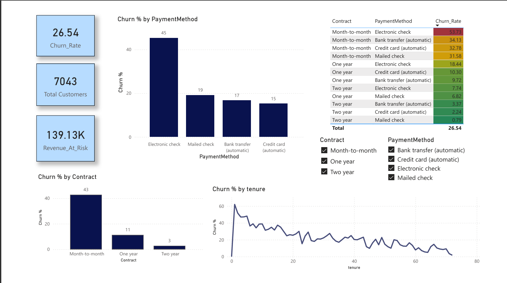

# Customer Churn Analysis

## Project Overview
This project analyzes customer churn behavior using SQL, Python, and Power BI to identify churn patterns and generate business insights for customer retention.

---

## Tools & Technologies
- Python
- Pandas
- NumPy
- SQL
- Power BI
- Jupyter Notebook

---

## Key Highlights
- Analyzed and cleaned 7,000+ customer records using SQL and Python
- Identified churn trends across customer tenure, contract types, and payment methods
- Built an interactive Power BI dashboard to visualize churn insights
- Observed highest churn among month-to-month contract users
- Overall churn rate identified: 26.5%

---

## Dashboard Preview

---

## Key Business Insights
- Month-to-month contracts showed the highest churn
- Electronic check users had significantly higher churn rates
- Long-term contracts showed better retention
- Customer churn reduced as tenure increased

---

## Project Files
- `customer analysis.ipynb`
- `churn analysis.sql`
- `churn analysis.pbix`
- `datachurn.csv`

---

## Author
Sachi Wadajkar
